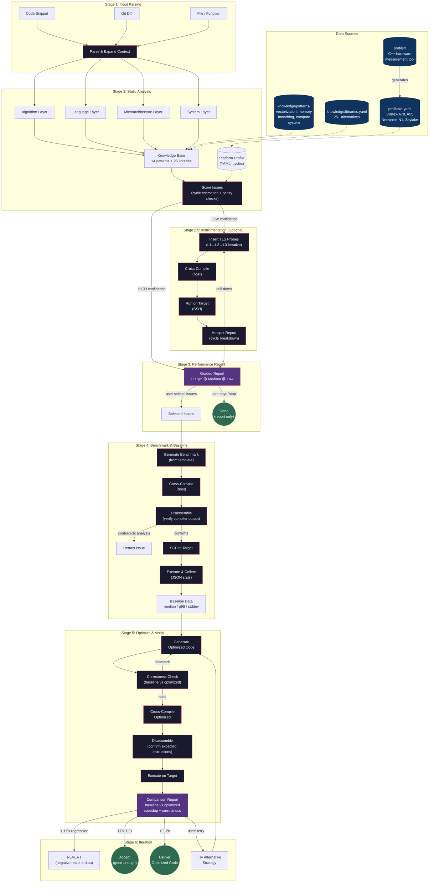
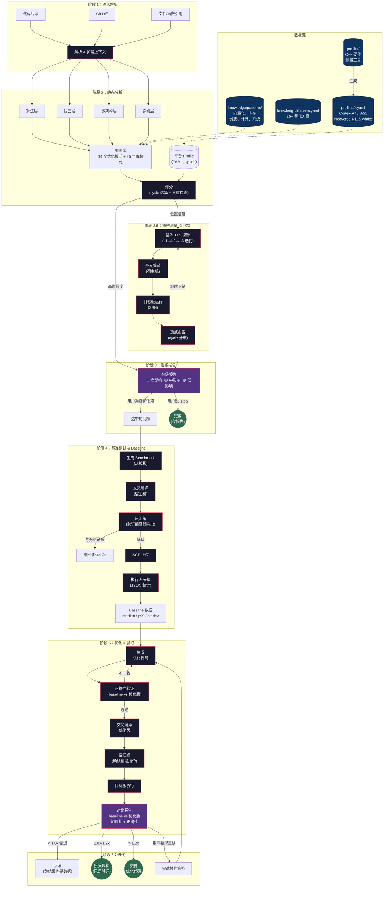

# cpp-perf: C++ Performance Optimization Skill for Claude Code

[English](#english) | [中文](#中文)

---

<a id="english"></a>

## English

A Claude Code superpowers skill that analyzes and optimizes C++ code for target platforms (ARM/X86). It operates as a 7-stage pipeline: static analysis, optional instrumentation profiling, performance report, benchmark generation, cross-compilation with disassembly analysis, remote execution, and data-driven optimization.

### Architecture Overview



### What It Does

Give it C++ code (snippet, git diff, or file reference) and a target platform. It will:

1. **Analyze** — scan for performance issues across 4 layers (algorithm, language, microarchitecture, system)
2. **Instrument** (optional) — insert lightweight TLS-based timing probes to measure actual hotspots
3. **Report** — grade issues by estimated impact (HIGH/MEDIUM/LOW) with cycle-level estimates
4. **Benchmark** — generate standalone benchmarks, cross-compile, disassemble to verify compiler output
5. **Optimize** — generate optimized code, verify correctness, measure speedup on target hardware
6. **Iterate** — try alternative strategies with clear stopping rules

### Quick Start

```bash
# In a Claude Code session with this skill installed:
> Optimize the performance of my_code.cpp for ARM Cortex-A78
```

The skill will guide you through the full pipeline interactively.

### Project Structure

```
skills/cpp-perf/
├── SKILL.md                    # Trigger metadata
├── cpp-perf.md                 # Pipeline instructions (7 stages)
├── templates/
│   ├── benchmark.cpp.tmpl      # Benchmark harness (steady_clock, JSON, DoNotOptimize)
│   ├── correctness.cpp.tmpl    # Optimization correctness verifier
│   └── cpp_perf_probe.h        # Instrumentation probe (TLS ring buffer, ns timing)
├── profiles/                   # Platform performance profiles (cycles)
│   ├── cortex-a78.yaml
│   ├── cortex-a55.yaml
│   ├── neoverse-n1.yaml
│   └── x86-skylake.yaml
├── knowledge/
│   ├── libraries.yaml          # 25+ high-perf library alternatives
│   └── patterns/               # 14 optimization patterns from references
│       ├── vectorization/      # Auto-vectorization blockers, NEON idioms, SVE
│       ├── memory/             # AoS→SoA, loop tiling, prefetch, false sharing
│       ├── branching/          # Branch→cmov (with counter-examples), lookup tables
│       ├── compute/            # Dependency chains, FMA, strength reduction
│       └── system/             # Huge pages, alignment
└── profiler/                   # C++ hardware profiler
    ├── CMakeLists.txt
    ├── common.h                # Timing, calibration, SIGILL fault tolerance
    ├── main.cpp                # CLI entry point
    ├── output.cpp              # Structured YAML output + CPU model detection
    ├── measure_compute.cpp     # 34 instruction measurements (int/fp/SIMD/LSE/crypto)
    ├── measure_cache.cpp       # Cache hierarchy detection via pointer chasing
    ├── measure_memory.cpp      # Bandwidth, TLB miss penalty
    ├── measure_branch.cpp      # Branch misprediction penalty
    ├── measure_os.cpp          # Syscall, thread, fork, synchronization primitives
    ├── measure_alloc.cpp       # malloc, mmap, page faults
    ├── measure_io.cpp          # File I/O (open/close, read/write, fsync)
    └── measure_ipc.cpp         # Pipe, eventfd, signal, scheduling
```

### Platform Profiler

Generates a platform performance profile by measuring actual hardware characteristics.

```bash
# Build (requires C++17)
cd skills/cpp-perf/profiler
mkdir build && cd build
cmake .. && make -j4

# Run (on target platform)
./profiler > my-board.yaml 2>progress.log

# Run specific measurements only
./profiler compute cache branch
```

Output is a YAML file compatible with the `profiles/` schema. Supports:
- **ARM aarch64** — NEON, DotProd, FP16, LSE atomics, CRC32, AES (with SIGILL fallback for unsupported extensions)
- **x86_64** — SSE, AVX (FMA if available)
- **macOS Apple Silicon** — full support via `mach_absolute_time()` + frequency calibration

### Knowledge Base

14 optimization patterns extracted from professional references:

| Source | Patterns |
|--------|----------|
| [perf-book](https://book.easyperf.net/perf_book) | Vectorization, memory access, branch prediction |
| [perf-ninja](https://github.com/dendibakh/perf-ninja) | Data packing, loop tiling, dependency chains, branchless |
| [ComputeLibrary](https://github.com/ARM-software/ComputeLibrary) | NEON intrinsic idioms |
| [optimized-routines](https://github.com/ARM-software/optimized-routines) | SVE patterns, FMA utilization |
| [Cpp-High-Performance](https://github.com/PacktPublishing/Cpp-High-Performance-Second-Edition) | Strength reduction |

Each pattern includes: problem description, detection method, before/after code, expected impact, and caveats (including when the optimization can make things **worse**).

### Key Design Decisions

- **Cycle-based estimation** with sanity checks — prevents over-confident recommendations (learned from a Game of Life case where "branchless optimization" caused a 3.2x regression)
- **Cross-compilation on host, execution on target** — the skill compiles on your dev machine and runs benchmarks on the ARM board via SSH
- **Disassembly verification** — always checks compiler output before claiming an optimization works
- **Correctness-first** — verifies optimized code matches baseline output before reporting speedup
- **Iterative with stopping rules** — regressions are immediately reverted; <1.2x gains are accepted as "good enough"

### Platform Configuration

On first use, the skill guides you through creating `cpp-perf-platform.yaml`:

```yaml
platforms:
  my-arm-board:
    compiler: aarch64-linux-gnu-g++
    compiler_flags: "-O2 -march=armv8.2-a"
    sysroot: /opt/arm-sysroot        # optional
    host: 192.168.1.100
    port: 22
    user: dev
    arch: aarch64
    work_dir: /tmp/cpp-perf
    profile: cortex-a78
```

### Documentation

- [Design Spec](docs/superpowers/specs/2026-03-19-cpp-perf-skill-design.md) — full architecture and pipeline design
- [Instrumentation Spec](docs/superpowers/specs/2026-03-19-instrumentation-design.md) — TLS probe infrastructure design
- [Plan 1: Core Skill](docs/superpowers/plans/2026-03-19-cpp-perf-plan1-core-skill.md)
- [Plan 2: Knowledge Base](docs/superpowers/plans/2026-03-19-cpp-perf-plan2-knowledge-base.md)
- [Plan 3: Profiler](docs/superpowers/plans/2026-03-19-cpp-perf-plan3-profiler.md)

---

<a id="中文"></a>

## 中文

一个 Claude Code 超能力技能（superpowers skill），用于自动分析和优化 C++ 代码在目标平台（ARM/X86）上的性能。采用 7 阶段流水线：静态分析、可选插桩测量、性能报告、基准测试生成、交叉编译+反汇编分析、远程执行、数据驱动优化。

### 架构总览



### 功能概述

给它一段 C++ 代码（代码片段、git diff 或文件引用）和目标平台，它会：

1. **分析** — 从 4 个层面扫描性能问题（算法、语言特性、微架构、系统）
2. **插桩**（可选） — 插入轻量级 TLS 计时探针，实测热点分布
3. **报告** — 按预估影响分级（高/中/低），附带 cycle 级估算
4. **基准测试** — 生成独立 benchmark，交叉编译，反汇编验证编译器输出
5. **优化** — 生成优化代码，验证正确性，在目标硬件上实测加速比
6. **迭代** — 尝试替代策略，有明确的停止规则

### 快速开始

```bash
# 在安装了此 skill 的 Claude Code 会话中：
> 优化 my_code.cpp 在 ARM Cortex-A78 上的性能
```

Skill 会引导你交互式地完成完整流水线。

### 项目结构

```
skills/cpp-perf/
├── SKILL.md                    # 触发元数据
├── cpp-perf.md                 # 流水线指令（7 个阶段）
├── templates/
│   ├── benchmark.cpp.tmpl      # 基准测试模板（steady_clock, JSON, 防优化消除）
│   ├── correctness.cpp.tmpl    # 优化正确性验证模板
│   └── cpp_perf_probe.h        # 插桩探针（TLS 环形缓冲区, 纳秒计时）
├── profiles/                   # 平台性能档案（cycle 为单位）
│   ├── cortex-a78.yaml
│   ├── cortex-a55.yaml
│   ├── neoverse-n1.yaml
│   └── x86-skylake.yaml
├── knowledge/
│   ├── libraries.yaml          # 25+ 高性能库替代方案
│   └── patterns/               # 14 个优化模式（从专业书籍提取）
│       ├── vectorization/      # 自动向量化障碍、NEON 惯用法、SVE
│       ├── memory/             # AoS→SoA、循环分块、预取、伪共享
│       ├── branching/          # 分支→条件移动（含反面案例）、查找表
│       ├── compute/            # 依赖链、FMA、强度削减
│       └── system/             # 大页、对齐
└── profiler/                   # C++ 硬件性能测量工具
    ├── CMakeLists.txt
    ├── common.h                # 计时、校准、SIGILL 容错
    ├── main.cpp                # CLI 入口
    ├── output.cpp              # 结构化 YAML 输出 + CPU 型号检测
    ├── measure_compute.cpp     # 34 项指令测量（整数/浮点/SIMD/LSE/加密）
    ├── measure_cache.cpp       # Cache 层级检测（指针追踪法）
    ├── measure_memory.cpp      # 带宽、TLB 缺失代价
    ├── measure_branch.cpp      # 分支预测失败代价
    ├── measure_os.cpp          # 系统调用、线程、fork、同步原语
    ├── measure_alloc.cpp       # malloc、mmap、缺页中断
    ├── measure_io.cpp          # 文件 I/O（open/close, read/write, fsync）
    └── measure_ipc.cpp         # 管道、eventfd、信号、调度
```

### 硬件性能测量工具

自动测量目标平台的硬件特性，生成性能档案。

```bash
# 构建（需要 C++17）
cd skills/cpp-perf/profiler
mkdir build && cd build
cmake .. && make -j4

# 在目标平台运行
./profiler > my-board.yaml 2>progress.log

# 只运行特定测量
./profiler compute cache branch
```

输出与 `profiles/` 目录下的 YAML 格式兼容。支持：
- **ARM aarch64** — NEON、DotProd、FP16、LSE 原子操作、CRC32、AES（不支持的指令自动跳过，不会崩溃）
- **x86_64** — SSE、AVX（支持 FMA 时自动检测）
- **macOS Apple Silicon** — 通过 `mach_absolute_time()` + 频率校准完整支持

### 知识库

从专业参考资料中提取的 14 个优化模式：

| 来源 | 覆盖的模式 |
|------|-----------|
| [perf-book](https://book.easyperf.net/perf_book) | 向量化、内存访问优化、分支预测 |
| [perf-ninja](https://github.com/dendibakh/perf-ninja) | 数据打包、循环分块、依赖链、无分支化 |
| [ComputeLibrary](https://github.com/ARM-software/ComputeLibrary) | NEON intrinsic 惯用法 |
| [optimized-routines](https://github.com/ARM-software/optimized-routines) | SVE 模式、FMA 利用 |
| [Cpp-High-Performance](https://github.com/PacktPublishing/Cpp-High-Performance-Second-Edition) | 强度削减 |

每个模式包含：问题描述、检测方法、优化前后代码、预期收益、以及**什么时候不该用**（比如 Game of Life 案例中，"无分支优化"反而导致 3.2 倍性能下降）。

### 核心设计理念

- **基于 cycle 的量化估算 + 三重检查** — 防止过度自信的优化建议（源自实测教训：Game of Life 的"无分支优化"在 Apple Silicon 上造成 3.2x 性能倒退）
- **宿主机交叉编译，目标板执行** — 在开发机上编译，通过 SSH 在 ARM 板上运行 benchmark
- **反汇编验证** — 每次优化前都检查编译器实际生成的指令，不靠猜
- **正确性优先** — 先验证优化后代码与原始代码输出一致，再报告加速比
- **有停止规则的迭代** — 性能倒退立即回滚；<1.2x 的提升接受现状，不做无意义的过度优化

### 平台配置

首次使用时，skill 会引导你创建 `cpp-perf-platform.yaml`：

```yaml
platforms:
  my-arm-board:
    compiler: aarch64-linux-gnu-g++
    compiler_flags: "-O2 -march=armv8.2-a"
    sysroot: /opt/arm-sysroot        # 可选
    host: 192.168.1.100
    port: 22
    user: dev
    arch: aarch64
    work_dir: /tmp/cpp-perf
    profile: cortex-a78
```

### 文档

- [设计文档](docs/superpowers/specs/2026-03-19-cpp-perf-skill-design.md) — 完整架构和流水线设计
- [插桩设计](docs/superpowers/specs/2026-03-19-instrumentation-design.md) — TLS 探针基础设施设计
- [实现计划 1：核心 Skill](docs/superpowers/plans/2026-03-19-cpp-perf-plan1-core-skill.md)
- [实现计划 2：知识库](docs/superpowers/plans/2026-03-19-cpp-perf-plan2-knowledge-base.md)
- [实现计划 3：性能测量工具](docs/superpowers/plans/2026-03-19-cpp-perf-plan3-profiler.md)

---

## License

MIT
